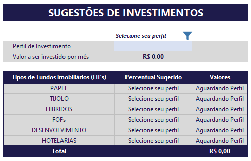

# 📊 Reis Invest — Simulador de Investimentos em Fundos Imobiliários (FIIs)


> **Laboratório Prático:** Desenvolvimento de uma ferramenta automatizada e interativa no Microsoft Excel para simulação de acúmulo de patrimônio, dividendos mensais e alocação estratégica de ativos em Fundos Imobiliários.

---

## 📌 Visão Geral do Projeto

O **Reis Invest** é um simulador financeiro desenvolvido em Excel com o objetivo de auxiliar investidores a tomar decisões informadas sobre o mercado de Fundos Imobiliários (FIIs). A ferramenta permite calcular o valor total investido, o patrimônio acumulado ao longo do tempo e a renda passiva proveniente de dividendos mensais em diferentes horizontes temporais (2, 5, 10, 20 e 30 anos).

Além das projeções de longo prazo, a planilha conta com um **módulo inteligente de sugestão de carteira**, que valida o perfil do investidor e orienta a alocação de ativos com base nas boas práticas do mercado financeiro.

💡 **Dica de Estudo (Tip):** Para se aprofundar no tema, analisar indicadores atualizados (*Dividend Yield*, P/VP, vacância) e pesquisar a fundo sobre os FIIs antes de investir, recomendamos consultar a plataforma [Investidor10](https://investidor10.com.br/).

---

## 🛠️ Recursos Técnicos e Funcionalidades no Excel

O projeto utilizou conceitos avançados de modelagem, automação e design de planilhas no Excel para garantir precisão nos cálculos e excelente experiência do usuário (*UX/UI*):

### 1. Fórmulas Financeiras e Tratamento de Erros
* **`VF` (Valor Futuro):** Utilizada para projetar o acúmulo de capital ao longo dos períodos (2, 5, 10, 20 e 30 anos), considerando aportes mensais recorrentes e a taxa de rendimento esperada.
* **`PROCV` combinado com `SEERRO`:** Implementada na tabela de sugestões de investimento. A função `SEERRO` foi essencial para garantir uma interface amigável: enquanto o usuário não seleciona seu perfil na célula correspondente, a planilha exibe dinamicamente a mensagem **"Selecione seu perfil"** na coluna de percentual e **"Aguardando Perfil"** na coluna de valores, evitando a exibição de erros brutos do Excel (como `#N/D` ou `#VALOR!`).



### 2. Validação de Dados e Controle de Entrada
* **Listas Suspensas (Data Validation):** Aplicadas nos campos de entrada para seleção padronizada (ex: Perfil de Investidor: *Conservador*, *Moderado*, *Sofisticado*).
* **Mensagens de Instrução e Alerta de Erro:** Configuradas para orientar o preenchimento correto e obrigar o usuário a definir as premissas antes da liberação dos dados de recomendação.

### 3. Organização, Nomenclatura e Design
* **Nomeação de Células e Intervalos:** Uso de intervalos nomeados (ex: `Perfil_Investidor`, `Aporte_Mensal`, `Taxa_Rendimento`) para facilitar a leitura das fórmulas e a manutenção do modelo.
* **Identidade Visual e Recuos:** Design moderno em tons de azul escuro (sem o clichê do verde convencional), utilizando recuos de texto, alinhamentos padronizados e inclusão de banner institucional no topo.
* **Proteção e Bloqueio de Planilha:** Trava contra alterações acidentais nas fórmulas e estruturas. **Apenas as células de input liberadas ao usuário estão destacadas em tom azul claro.**

---

## 📖 Guia do Usuário — Como Utilizar a Planilha

Siga as instruções abaixo para realizar suas simulações na ferramenta:

### ⚙️ Passos de Configuração Inicial

1. **Renda Mensal:**
   * Localize o campo destacado em **azul claro** no painel de configurações e informe a sua **Renda/Salário Mensal**.
2. **Rendimento da Carteira:**
   * Insira a taxa de rendimento estimada para a sua carteira (ex: % ao mês ou ao ano).
3. **Sugestão de Aporte (Regra dos 20%):**
   * A plataforma calculará automaticamente uma sugestão de aporte mensal recomendada por especialistas (20% da sua renda), servindo de balizador financeiro.

---

### 📈 Simulação de Investimento Mensal

1. **Definição de Aporte:**
   * No campo de **Investimento Mensal** (azul claro), informe o valor real que você está disposto a investir mensalmente.
2. **Tempo e Taxa:**
   * Ajuste o tempo de investimento e a taxa esperada de dividendos.
3. **Cenários Multitemporais:**
   * A planilha gera instantaneamente uma matriz de projeção mostrando o **Valor Investido** vs. **Patrimônio Acumulado** e os **Dividendos Mensais Estimados** para os períodos de:
     * ⏳ **2 anos**
     * ⏳ **5 anos**
     * ⏳ **10 anos**
     * ⏳ **20 anos**
     * ⏳ **30 anos**

---

### 🧱 Sugestões de Investimento em FIIs

1. **Seleção do Perfil:**
   * Role a tela até a seção **Sugestões de Investimentos**.
   * Clique na célula destacada em **azul claro** (ao lado de *Perfil de Investimento*) e escolha a sua classificação na lista suspensa.
2. **Exibição Dinâmica:**
   * Enquanto a célula estiver vazia, os campos indicarão **"Selecione seu perfil"** e **"Aguardando Perfil"**. Assim que o perfil for selecionado, os percentuais e valores por categoria (*Papel, Tijolo, Híbridos, FOFs, Desenvolvimento e Hotelarias*) serão calculados automaticamente.

---

### 📊 Alocação Estratégica de Carteira

* Ao final da página, você visualizará um **Gráfico Interativo de Divisão da Carteira**, ilustrando visualmente a proporção ideal de distribuição entre as classes de FIIs com base no seu perfil.

---

## 📂 Estrutura do Repositório

```text
├── README.md                          # Documentação principal do projeto
├── Reis_Invest.xlsx                    # Planilha automatizada de simulação em Excel
└── images/
    ├── banner_reis_invest.png         # Banner/Identidade visual do projeto
    └── selecao_de_perfil.png          # Print demonstrativo da validação com SEERRO
```

---

## 👨‍🏫 Orientação Técnica

Este projeto foi desenvolvido com base nas instruções e mentoria do professor e orientador:

* **Orientador:** Felipe Aguiar
  * **GitHub:** [https://github.com/felipeAguiarCode](https://github.com/felipeAguiarCode)
  * **Instagram:** [https://www.instagram.com/felipeaguiar.exe/](https://www.instagram.com/felipeaguiar.exe/)
  * **LinkedIn:** [https://www.linkedin.com/in/felipeaguiar-exe/](https://www.linkedin.com/in/felipeaguiar-exe/)

---

## ✉️ Contato e Redes Sociais

Sinta-se à vontade para acompanhar meus projetos, trocar ideias sobre análise de dados e tecnologia ou entrar em contato através das redes abaixo:

* **Desenvolvedor:** André Reis
  * **GitHub:** [https://github.com/andrereistech](https://github.com/andrereistech)
  * **LinkedIn:** [https://www.linkedin.com/in/andre-reis-tech/](https://www.linkedin.com/in/andre-reis-tech/)
  * **Instagram:** [https://www.instagram.com/reis_dadosetech/](https://www.instagram.com/reis_dadosetech/)
  
